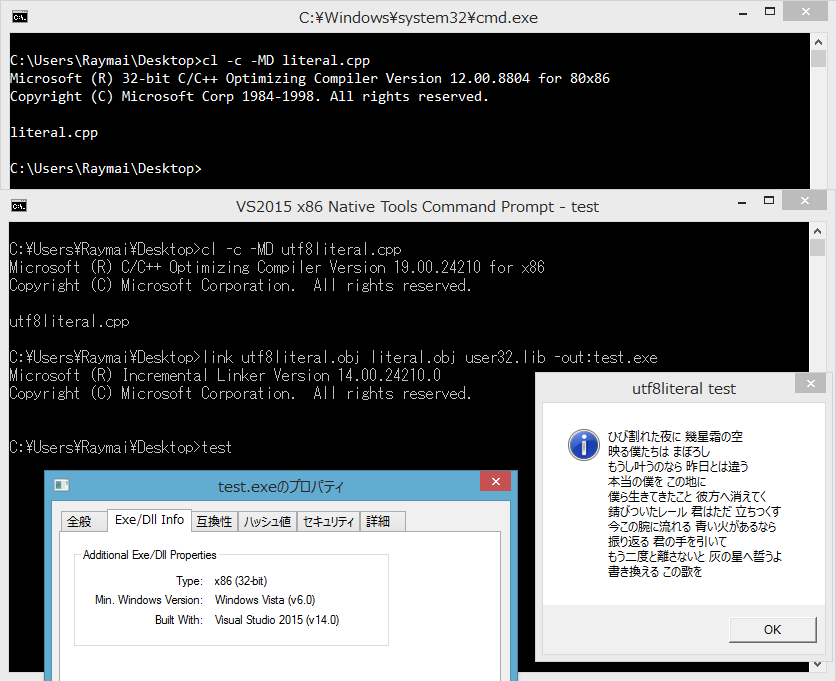

# UTF-8 string literal and MSVC

This article targets Microsoft Visual Studio 2005 to 2015, so I will not talk about the [u8 prefix](http://en.cppreference.com/w/cpp/language/string_literal) here.

It is actually possible to use UTF-8 string literal and compile with MSVC, but there are some rules you must follow. First, the file **must** be saved in encoding of **UTF-8 without BOM**. Next, you have to make sure your **system locale** (language for non-Unicode programs) is **English**, with codepage of 437. No, I'm not joking. Here is the testing code I used:

```cpp
#include <stdio.h>
#include <Windows.h>

LPCSTR const szUtf8 =
	"ひび割れた夜に 幾星霜の空 \n"
	"映る僕たちは まぼろし \n"
	"もうし叶うのなら 昨日とは違う \n"
	"本当の僕を この地に \n"
	"僕ら生きてきたこと 彼方へ消えてく \n"
	"錆びついたレール 君はただ 立ちつくす \n"
	"今この腕に流れる 青い火があるなら \n"
	"振り返る 君の手を引いて \n"
	"もう二度と離さないと 灰の星へ誓うよ \n"
	"書き換える この歌を";

int main() {
	HWND hwnd = GetForegroundWindow();
	int cchWide = MultiByteToWideChar(CP_UTF8, 0, szUtf8, -1, NULL, 0);
	LPWSTR szWide = new wchar_t[cchWide];
	int cchOk = MultiByteToWideChar(CP_UTF8, 0, szUtf8, -1, szWide, cchWide);
	if (cchWide != cchOk) {
		printf("cch mismatch error\n");
		printf("GetLastError() returns %i \n", GetLastError());
	}
	else {
		MessageBoxW(hwnd, szWide, L"utf8literal test", MB_ICONASTERISK);
	}
    delete[] szWide;
	return 0;
}
```

The source code is saved in UTF-8 no BOM encoding, and then compiled with MSVC2005 compiler.


Bummer. Let's try other system locale.


Brace yourself. Things changed when the system locale is...


Yeah, the warning has disappeared, and the test program runs perfectly.


What if the warning is just a joke? I hope so, but it is not:


I don't know why MSVC product team decided to make their compiler behaves differently according to the system codepage. It just doesn't make sense to me. The TDM-GCC compiler doesn't suffer from this problem though. (```g++ utf8literal.cpp -luser32```)

### Bouns: VC98 has surprise for you

You might think VC98 has utterly broken Unicode support. It turns out it accepts some kinds of UTF-8 string literal, as long as the file encoding is **UTF-8 without BOM**. Here is a shot:


### Bouns2: Mixing object files

Since VC98 is not racist like newer MSVC, what about we use VC98 for compiling string literal into object file, and then combine it with other object file to produce a EXE?

First, separate the code into two files:

```c++
// utf8literal.cpp
#include <stdio.h>
#include <Windows.h>

extern char const * szUtf8;

int main() {
	HWND hwnd = GetForegroundWindow();
	int cchWide = MultiByteToWideChar(CP_UTF8, 0, szUtf8, -1, NULL, 0);
	LPWSTR szWide = new wchar_t[cchWide];
	int cchOk = MultiByteToWideChar(CP_UTF8, 0, szUtf8, -1, szWide, cchWide);
	if (cchWide != cchOk) {
		printf("cch mismatch error\n");
		printf("GetLastError() returns %i \n", GetLastError());
	}
	else {
		MessageBoxW(hwnd, szWide, L"utf8literal test", MB_ICONASTERISK);
	}
	return 0;
}
```

```c++
// literal.cpp
char const * szUtf8 =
	"ひび割れた夜に 幾星霜の空 \n"
	"映る僕たちは まぼろし \n"
	"もうし叶うのなら 昨日とは違う \n"
	"本当の僕を この地に \n"
	"僕ら生きてきたこと 彼方へ消えてく \n"
	"錆びついたレール 君はただ 立ちつくす \n"
	"今この腕に流れる 青い火があるなら \n"
	"振り返る 君の手を引いて \n"
	"もう二度と離さないと 灰の星へ誓うよ \n"
	"書き換える この歌を";
```

Then we generate object file of `literal.cpp` using MSVC6.0 compiler, and `utf8literal.cpp` using MSVC2005 compiler. Finally, we `link` them together to get a EXE file. Here is the result:


Instead of MSVC2005, you can combine with MSVC2015 too. Who don't like modern C++ support?



Note that mixing different version of CRT may lead to undesirable effect. However, as long as you're only using this method for string literal, you should be fine. 
